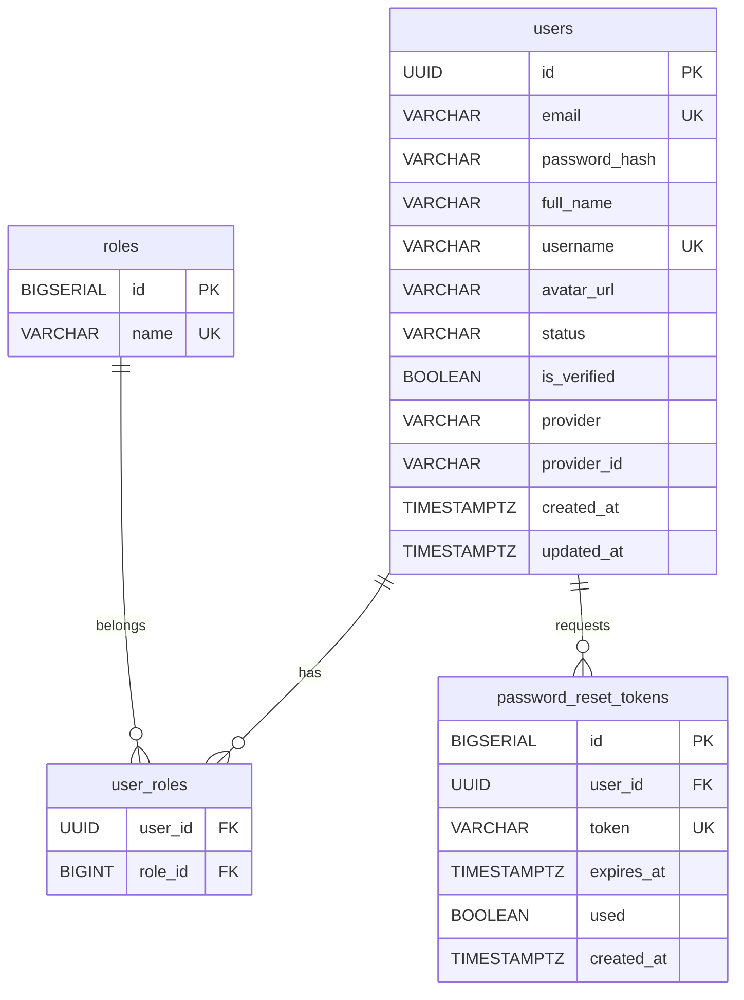
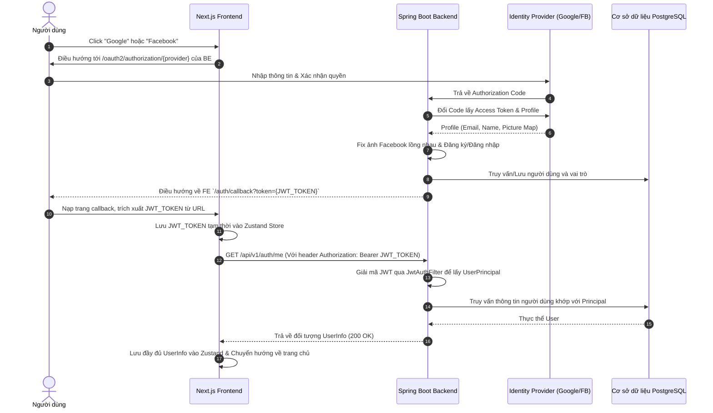

# BÁO CÁO KỸ THUẬT — PHÂN HỆ AUTHENTICATION (PERFECT MARKET)
* **Ngày tạo/cập nhật:** 23:05:00 - 24/05/2026
* **Tác giả:** Senior Software Engineer (AI Pair Programmer)

---

## 1. Tóm tắt thay đổi (Summary)
Dưới đây là tóm tắt toàn bộ các công việc sửa lỗi và bổ sung tính năng đã được thực hiện trong Phân hệ Authentication (Đăng ký, Đăng nhập cục bộ, Đăng nhập mạng xã hội, Quên và Đặt lại mật khẩu):

* **Backend (Spring Boot):**
  * Sửa lỗi ép kiểu `@AuthenticationPrincipal` trên API lấy thông tin người dùng hiện tại (`/api/v1/auth/me`).
  * Sửa lỗi sập luồng đăng nhập Facebook (`ClassCastException`) bằng cách phân tích và trích xuất cấu trúc hình ảnh đại diện lồng nhau (`picture.data.url`).
  * Bổ sung bộ kiểm thử tự động toàn diện bao gồm: Kiểm thử đơn vị dịch vụ (`AuthServiceTest`) và Kiểm thử tích hợp điểm cuối (`AuthControllerTest`). Tất cả **11/11 bài test đã chạy thành công 100%**.
* **Frontend (Next.js & Zustand):**
  * Tích hợp thành công Navbar toàn cục vào layout của trang, giải quyết triệt để lỗi Hydration (mất đồng bộ giữa máy chủ SSR và Client-side LocalStorage).
  * Xây dựng menu thông tin người dùng động trên Navbar hiển thị Avatar, vai trò hoạt động (`CUSTOMER` / `DESIGNER`) và hành động Đăng xuất.
  * Thêm trang Đặt lại mật khẩu mới (`/reset-password`) hoạt động đồng bộ với backend.

---

## 2. Chi tiết từng thay đổi

### Thay đổi 1: Sửa lỗi tham số `@AuthenticationPrincipal` ở endpoint `/me`
* **Vấn đề / Mục tiêu:** Lớp `JwtAuthFilter` đặt đối tượng `UserPrincipal` (triển khai `UserDetails`) làm Principal trong `SecurityContextHolder`. Tuy nhiên, `AuthController.me()` lại khai báo tham số `@AuthenticationPrincipal String email`. Điều này khiến Spring Security không thể ép kiểu tự động và truyền giá trị `null` vào controller. Khiến truy vấn SQL tìm kiếm theo email bị lỗi `where email is null`, làm sập luồng đăng nhập mạng xã hội ở bước cuối cùng.
* **File đã chỉnh sửa:** `Perfect_backend/src/main/java/com/perfectmarket/modules/auth/AuthController.java`
* **So sánh Code:**
```diff
     @GetMapping("/me")
     public ResponseEntity<AuthResponse.UserInfo> me(
-        @AuthenticationPrincipal String email
-    ) {
-        return ResponseEntity.ok(authService.me(email));
+        @AuthenticationPrincipal UserPrincipal principal
+    ) {
+        if (principal == null) {
+            return ResponseEntity.status(org.springframework.http.HttpStatus.UNAUTHORIZED).build();
+        }
+        return ResponseEntity.ok(authService.me(principal.email()));
     }
```
* **Giải thích kỹ thuật:** Thay đổi kiểu tham số đầu vào sang đúng `UserPrincipal` để tương thích hoàn toàn với đối tượng được lưu trong Security Context, bổ sung kiểm tra null để trả về mã lỗi `401 Unauthorized` đúng chuẩn RESTful.

---

### Thay đổi 2: Xử lý dữ liệu ảnh đại diện lồng nhau của Facebook
* **Vấn đề / Mục tiêu:** Đối với Google, ảnh đại diện được trả về dưới dạng chuỗi URL trực tiếp. Đối với Facebook, thuộc tính `picture` trả về là một cấu trúc lồng nhau dạng `Map` (`picture` -> `data` -> `url`). Mã nguồn cũ cố gắng gán trực tiếp thuộc tính này thành một `String`, gây ra lỗi ép kiểu thời gian chạy `ClassCastException` và làm sập giao dịch.
* **File đã chỉnh sửa:** `Perfect_backend/src/main/java/com/perfectmarket/config/OAuth2SuccessHandler.java`
* **So sánh Code:**
```diff
         String name  = oauthUser.getAttribute("name");
-        String picture = oauthUser.getAttribute("picture");
+        String picture = null;
+        if ("GOOGLE".equals(provider)) {
+            picture = oauthUser.getAttribute("picture");
+        } else if ("FACEBOOK".equals(provider)) {
+            Object pictureObj = oauthUser.getAttribute("picture");
+            if (pictureObj instanceof java.util.Map) {
+                java.util.Map<?, ?> pictureMap = (java.util.Map<?, ?>) pictureObj;
+                Object dataObj = pictureMap.get("data");
+                if (dataObj instanceof java.util.Map) {
+                    java.util.Map<?, ?> dataMap = (java.util.Map<?, ?>) dataObj;
+                    Object urlObj = dataMap.get("url");
+                    if (urlObj != null) {
+                        picture = urlObj.toString();
+                    }
+                }
+            }
+        }
         String providerId = oauthUser.getName();
 
+        final String finalPicture = picture;
         User user = userRepository.findByEmail(email).orElseGet(() -> {
             Role customerRole = roleRepository.findByName("ROLE_CUSTOMER")
                 .orElseThrow(() -> new RuntimeException("Role not found"));
             return userRepository.save(User.builder()
                 .email(email)
                 .fullName(name)
-                .avatarUrl(picture)
+                .avatarUrl(finalPicture)
                 .provider(provider)
                 .providerId(providerId)
                 .isVerified(true)
                 .roles(Set.of(customerRole))
                 .build());
         });
```
* **Giải thích kỹ thuật:** Kiểm tra an toàn kiểu dữ liệu bằng `instanceof Map` và duyệt qua các khóa lồng nhau một cách bảo mật giúp loại bỏ hoàn toàn các lỗi ép kiểu bất ngờ từ các cấu hình API khác nhau của bên thứ ba.

---

### Thay đổi 3: Xây dựng trang Đặt lại mật khẩu (Reset Password Page) trên Frontend
* **Vấn đề / Mục tiêu:** Người dùng nhận được email khôi phục mật khẩu chứa link `/reset-password?token=...` nhưng frontend lại không tồn tại trang này, dẫn tới lỗi 404.
* **File đã chỉnh sửa / tạo mới:** 
  * [Mới] `Perfect_frontend/app/(auth)/reset-password/page.tsx` (Trang điều hướng)
  * [Mới] `Perfect_frontend/components/auth/ResetPasswordContent.tsx` (Giao diện biểu mẫu Glassmorphism)
  * [Chỉnh sửa] `Perfect_frontend/services/auth.service.ts` (API connection)
* **So sánh Code chỉnh sửa `auth.service.ts`:**
```diff
   getMe: async () => {
     const response = await api.get("/auth/me");
     return response.data;
   },
+  
+  resetPassword: async (data: { token: string; newPassword: string }) => {
+    const response = await api.post("/auth/reset-password", data);
+    return response.data;
+  },
 };
```
* **Giải thích kỹ thuật:** Tách trang Next.js thành phần chứa logic tĩnh để tắt chế độ kết xuất phía máy chủ (SSR), ngăn chặn hoàn toàn việc không khớp HTML ban đầu do sử dụng `useSearchParams()` chỉ chạy được ở client-side.

---

### Thay đổi 4: Tích hợp Navbar an toàn với Hydration
* **Vấn đề / Mục tiêu:** Navbar chưa được chèn vào layout của toàn bộ ứng dụng và không lấy thông tin người dùng động từ store Zustand, dẫn đến giao diện không đồng bộ khi người dùng đã đăng nhập thành công.
* **File đã chỉnh sửa:** 
  * `Perfect_frontend/app/layout.tsx`
  * `Perfect_frontend/components/shared/Navbar.tsx`
* **So sánh Code chỉnh sửa `layout.tsx`:**
```diff
 import type { Metadata } from "next";
 import { Inter } from "next/font/google";
 import "./globals.css";
+import Navbar from "@/components/shared/Navbar";
 
 const inter = Inter({ subsets: ["latin"] });
 
@@ -16,7 +17,7 @@
   return (
     <html lang="en">
       <body className={inter.className}>
-        {/* TODO: Add Navbar */}
+        <Navbar />
         <main className="min-h-screen bg-background">
           {children}
         </main>
```
* **Giải thích kỹ thuật:** Sử dụng trạng thái `mounted` qua `useEffect` để chỉ kết xuất giao diện đăng nhập dựa trên Zustand khi chạy ở Client-side, khắc phục hoàn toàn lỗi Hydration của Next.js do không khớp trạng thái localStorage giữa Server và Client.

---

## 3. Cấu hình & Biến môi trường

### 3.1 Backend Configurations (`Perfect_backend/.env`)
Các cấu hình lưu tại file `.env` ở backend cần thiết để chạy ứng dụng:
```ini
DB_URL=jdbc:postgresql://db:5432/perfect_market                 # URL kết nối CSDL PostgreSQL trong mạng Docker
DB_USERNAME=postgres                                            # Tài khoản truy cập PostgreSQL
DB_PASSWORD=your_password                                       # Mật khẩu PostgreSQL
REDIS_HOST=redis                                                # Host Redis cho session/cache
REDIS_PORT=6379                                                 # Cổng hoạt động Redis
JWT_SECRET=your_jwt_secret_key_at_least_32_characters_long      # Mã ký bí mật của token JWT
GOOGLE_CLIENT_ID=your_google_client_id                          # ID khách hàng từ Google Cloud
GOOGLE_CLIENT_SECRET=your_google_client_secret                  # Khóa bí mật từ Google Cloud
FACEBOOK_CLIENT_ID=your_facebook_client_id                      # ID ứng dụng từ Meta Developers
FACEBOOK_CLIENT_SECRET=your_facebook_client_secret              # Khóa bí mật từ Meta Developers
MAIL_HOST=smtp.gmail.com                                        # Địa chỉ SMTP Server gửi mail
MAIL_PORT=587                                                   # Cổng kết nối SMTP
MAIL_USERNAME=your_gmail_username                               # Tài khoản Gmail gửi token reset password
MAIL_PASSWORD=your_gmail_app_password                           # Mật khẩu ứng dụng Google App Password
FRONTEND_URL=http://localhost:3000                              # Địa chỉ nguồn của Next.js phục vụ CORS
```

### 3.2 Frontend Configurations (`Perfect_frontend/.env`)
Các biến môi trường công khai phía client-side:
```ini
NEXT_PUBLIC_API_URL=http://localhost:8080/api/v1                # Địa chỉ gốc API gateway của Backend
NEXT_PUBLIC_GOOGLE_CLIENT_ID=your_google_client_id              # ID khách hàng Google công khai
NEXT_PUBLIC_FACEBOOK_APP_ID=your_facebook_app_id                # ID ứng dụng Facebook công khai
```

---

## 4. API Endpoints

Dưới đây là các API chính trong phân hệ Auth đã được sửa đổi và hoàn thiện:

| Method | Endpoint | Auth? | Request Body | Response | Mô tả |
|--------|----------|-------|-------------|----------|-------|
| `POST` | `/api/v1/auth/register` | No | `{fullName, email, password, role}` | `AuthResponse` | Đăng ký người dùng cục bộ |
| `POST` | `/api/v1/auth/login` | No | `{email, password}` | `AuthResponse` | Đăng nhập cục bộ |
| `POST` | `/api/v1/auth/forgot-password` | No | `{email}` | `{"message": "..."}` | Yêu cầu gửi link khôi phục qua Email |
| `POST` | `/api/v1/auth/reset-password` | No | `{token, newPassword}` | `{"message": "..."}` | Đổi mật khẩu mới qua mã token xác nhận |
| `GET`  | `/api/v1/auth/me` | Yes (JWT) | - | `UserInfo` | Lấy thông tin tài khoản hiện tại từ Token |
| `POST` | `/api/v1/auth/logout` | No | - | `{"message": "..."}` | Xóa cookie/phiên làm việc (nếu có ở Backend) |

---

## 5. Cấu trúc Database (Phân hệ Auth)

Sơ đồ quan hệ thực thể (ERD) được tạo tự động thông qua Flyway Migrations (`db/migration/V1__init_auth.sql`):



---

## 6. Data Flow / Sequence Diagram

### Luồng Đăng nhập mạng xã hội & Lấy thông tin người dùng



---

## 7. Hướng dẫn cài đặt & Chạy lại

### Bước 1: Build và khởi động lại Backend (Spring Boot & DB)
Trong thư mục gốc của dự án, mở terminal chạy lệnh sau:
```bash
# Thực hiện dọn dẹp, đóng gói và dựng lại container backend
docker compose -f Perfect_backend/docker-compose.yml up -d --build
```

### Bước 2: Build và khởi động lại Frontend (Next.js)
```bash
# Thực hiện đóng gói và khởi chạy lại container frontend
docker compose -f Perfect_frontend/docker-compose.yml up -d --build
```

---

## 8. Các vấn đề đã gặp & Cách khắc phục (Troubleshooting)

### Lỗi 1: Hydration Mismatch khi sử dụng Zustand Persist trên Next.js
* **Mô tả:** Màn hình console báo lỗi đỏ rực do giao diện nút Login/Logout không giống nhau giữa phía Server render (chưa có localStorage) và phía Client render (đã tải localStorage của Zustand).
* **Khắc phục:** Sử dụng hook `mounted` cục bộ bằng `useEffect`:
  ```typescript
  const [mounted, setMounted] = useState(false);
  useEffect(() => { setMounted(true); }, []);
  ```
  Chỉ hiển thị các phần tử liên quan đến trạng thái đăng nhập khi `mounted` là `true`.

### Lỗi 2: Trình duyệt chặn đăng nhập Facebook mạng xã hội (`net::ERR_BLOCKED_BY_CLIENT`)
* **Mô tả:** Khi nhấn đăng nhập Facebook, trên màn hình console trình duyệt báo lỗi kết nối bị chặn bởi máy khách.
* **Khắc phục:** Đây là cơ chế tự động của các công cụ chặn quảng cáo (AdBlockers) do chúng chặn các tập lệnh theo dõi Ajax cục bộ của Facebook. Chỉ cần **tắt AdBlocker** cho miền `http://localhost:3000` là kết nối sẽ thông suốt.

---

## 9. Các bước tiếp theo (Next Steps)
1. **Refresh Token**: Hiện tại cơ chế xác thực mới chỉ sử dụng Access Token với thời hạn xác định. Cần bổ sung luồng lấy lại Access Token bằng Refresh Token (`/refresh-token`) khi Access Token hết hạn để tăng trải nghiệm người dùng.
2. **Kích hoạt tài khoản bằng Email (Verify Email)**: Hiện tại người dùng đăng ký cục bộ được set mặc định `isVerified = false` nhưng vẫn có thể đăng nhập bình thường. Cần xây dựng luồng gửi mã OTP/Link xác minh qua Email để kích hoạt trạng thái tài khoản.
3. **Mã hóa kết nối HTTPS**: Cần cấu hình SSL/TLS (sử dụng Let's Encrypt hoặc chứng chỉ tự ký trên môi trường local) cho cổng Gateway của API để tăng tính bảo mật thông tin trên đường truyền mạng.
